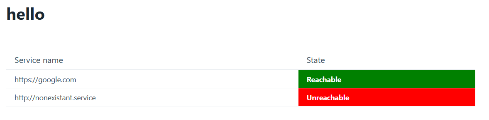

# svc-conn

A dead simple go app that will do a request to all domains set in the `SERVICE_DOMAINS` environment variable, and display a page with results of the reachability of all of them.

#### Example screenshot



## Usage

### Local

```bash
export SERVICE_DOMAINS="https://google.com,http://nonexistant.service"
./svc-conn
```

### Docker

```bash
sudo docker run -d -p 7887:7887 -e "SERVICE_DOMAINS=https://google.com,http://nonexistant.service" bonemind/svc-conn
```


